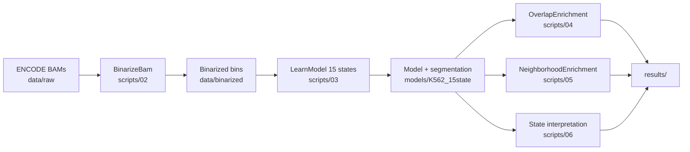

# K562 Epigenome Annotation with ChromHMM

We annotate the **K562** chronic myeloid leukemia epigenome using [ChromHMM](https://compbio.mit.edu/ChromHMM/) on six canonical ENCODE histone ChIP-seq marks plus an input control. ChromHMM learns a multivariate hidden Markov model over **200 bp** bins of binarized mark signal and assigns each genomic bin one of **15** chromatin states, aligned with the Roadmap Epigenomics reference framework. This repository holds our data manifest, reproducible pipeline scripts, and (once training completes) model interpretation and enrichment outputs.

## Team

This is a **team project** for CS 189, UC Irvine. All members contributed equally.

**Advisor:** Dr. Jing Zhang ([zhang.jing@uci.edu](mailto:zhang.jing@uci.edu))

## Background

**ChromHMM** (Chromatin state discovery by Hidden Markov Modeling) segments the genome into a finite set of chromatin states by jointly modeling combinatorial patterns of histone modifications ([Ernst & Kellis, 2012](https://www.nature.com/articles/nmeth.1906)). Raw ChIP-seq alignments are first converted to **binarized** presence/absence calls per mark in fixed-width bins (default **200 bp**). A **multivariate HMM** then learns emission probabilities (which marks are on or off in each state) and transition structure along each chromosome. The result is a genome-wide segmentation that summarizes high-dimensional epigenomic data into interpretable functional labels—promoters, enhancers, transcribed regions, repressed domains, and heterochromatin—without hand-tuning rules for every mark combination.

## Why these six marks?

We use the **canonical core histone set** used across Roadmap and ENCODE compendia. Together they distinguish the major functional compartments of the genome:

| Mark | Typical role |
|------|----------------|
| **H3K4me3** | Active promoters / transcription start sites |
| **H3K4me1** | Enhancers and other distal regulatory elements |
| **H3K27ac** | Active regulatory elements (promoters and enhancers) |
| **H3K36me3** | Gene bodies of actively transcribed genes |
| **H3K27me3** | Polycomb-mediated repression |
| **H3K9me3** | Constitutive heterochromatin / repressive domains |
| **Input control** | Background normalization for all ChIP experiments |

## Data

**Cell line:** K562 (ENCODE Tier 1)  
**Assembly:** GRCh38 / hg38  
**Source:** ENCODE Bernstein/Broad histone ChIP-seq (uniform processed BAMs)

| Mark | ENCODE file | Experiment | Lab |
|------|-------------|------------|-----|
| H3K4me3 | [ENCFF855ZMQ](https://www.encodeproject.org/files/ENCFF855ZMQ/) | ENCSR668LDD | Bernstein/Broad |
| H3K4me1 | [ENCFF839DZV](https://www.encodeproject.org/files/ENCFF839DZV/) | ENCSR000AKS | Bernstein/Broad |
| H3K27ac | [ENCFF600THN](https://www.encodeproject.org/files/ENCFF600THN/) | ENCSR000AKP | Bernstein/Broad |
| H3K27me3 | [ENCFF954SSM](https://www.encodeproject.org/files/ENCFF954SSM/) | ENCSR000AKQ | Bernstein/Broad |
| H3K36me3 | [ENCFF594GRL](https://www.encodeproject.org/files/ENCFF594GRL/) | ENCSR000AKR | Bernstein/Broad |
| H3K9me3 | [ENCFF104THG](https://www.encodeproject.org/files/ENCFF104THG/) | ENCSR000APE | Bernstein/Broad |
| Control | [ENCFF226FKB](https://www.encodeproject.org/files/ENCFF226FKB/) | ENCSR000AKY | Bernstein/Broad |

Mark-to-file mapping for ChromHMM is defined in `data/raw/cellmarkfiletable.txt` (cell type, mark, ChIP BAM, control BAM per line).

## Pipeline



ASCII overview:

```
  ENCODE BAMs (data/raw/)
           |
           v
    BinarizeBam  --------->  data/binarized/
           |
           v
    LearnModel (15 states, hg38)  ----->  models/K562_15state/
           |
           +------> OverlapEnrichment (hg38 coordinates)
           +------> NeighborhoodEnrichment (RefSeq TSS)
           +------> emissions heatmap + state_annotations.tsv
           |
           v
       results/
```

## Reproduction (Windows PowerShell)

Prerequisites: **Java 8+**, network access for first-time ChromHMM download, and BAMs placed under `data/raw/` per `cellmarkfiletable.txt`.

From the repository root:

```powershell
cd C:\Users\mukun\chromhmm-project

# 1. Folders, ChromHMM, Java check
.\scripts\01_setup.ps1

# 2. Binarize histone signal (long-running)
.\scripts\02_binarize.ps1

# 3. Learn 15-state model (long-running; optional -NumStates)
.\scripts\03_learn_model.ps1
# .\scripts\03_learn_model.ps1 -NumStates 18

# 4. Overlap enrichment vs. genomic annotations
.\scripts\04_overlap_enrichment.ps1

# 5. Neighborhood enrichment around TSSs
.\scripts\05_neighborhood_enrichment.ps1

# 6. Interpret states (Python; requires seaborn, matplotlib, pandas)
python .\scripts\06_interpret_states.py
```

See [tutorial/README.md](tutorial/README.md) for a beginner-oriented walkthrough and interpretation notes.

## Repository structure

```
chromhmm-project/
├── README.md
├── LICENSE
├── .gitignore
├── data/
│   ├── raw/                       # ENCODE BAMs + cellmarkfiletable.txt (gitignored BAMs)
│   └── binarized/                 # ChromHMM binarized output (gitignored)
├── ChromHMM/                      # ChromHMM distribution (gitignored after setup)
├── models/                        # LearnModel output (gitignored)
├── results/                       # Enrichment tables, plots, annotations
├── scripts/
│   ├── 01_setup.ps1
│   ├── 02_binarize.ps1
│   ├── 03_learn_model.ps1
│   ├── 04_overlap_enrichment.ps1
│   ├── 05_neighborhood_enrichment.ps1
│   └── 06_interpret_states.py
└── tutorial/
    └── README.md
```

## Requirements

| Component | Notes |
|-----------|--------|
| **Java** | JDK/JRE 8 or newer (`java -version`) |
| **ChromHMM** | Installed via `scripts/01_setup.ps1` (v1.24+ from MIT) |
| **Python 3** | For `06_interpret_states.py`: `pandas`, `matplotlib`, `seaborn` |
| **Disk** | Tens of GB for BAMs, binarized data, and model output |
| **RAM** | Scripts use `-mx4000M`; increase if LearnModel fails with `OutOfMemoryError` |
| **bedtools** | Optional; used in tutorial examples for querying segment BED files |

## Results

<!-- TODO: Fill in after LearnModel completes -->

**To be added after model training.** We will document state counts, example loci, enrichment highlights, and links to figures in `results/` (emissions heatmap, `state_annotations.tsv`, overlap/neighborhood enrichment outputs).

## References

1. Ernst, J. & Kellis, M. ChromHMM: automating chromatin-state discovery and characterization. *Nat. Methods* **9**, 215–216 (2012). https://doi.org/10.1038/nmeth.1906  
2. Ernst, J. & Kellis, M. Chromatin-state discovery and genome annotation with ChromHMM. *Nat. Protoc.* **12**, 2478–2492 (2017). https://doi.org/10.1038/nprot.2017.124  
3. Roadmap Epigenomics Consortium et al. Integrative analysis of 111 reference human epigenomes. *Nature* **518**, 317–330 (2015). https://doi.org/10.1038/nature14248  
4. ENCODE Project Consortium et al. Expanded encyclopaedias of DNA elements in the human and mouse genomes. *Nature* **583**, 699–710 (2020). https://doi.org/10.1038/s41586-020-2493-4  

## License

This project is released under the [MIT License](LICENSE).
