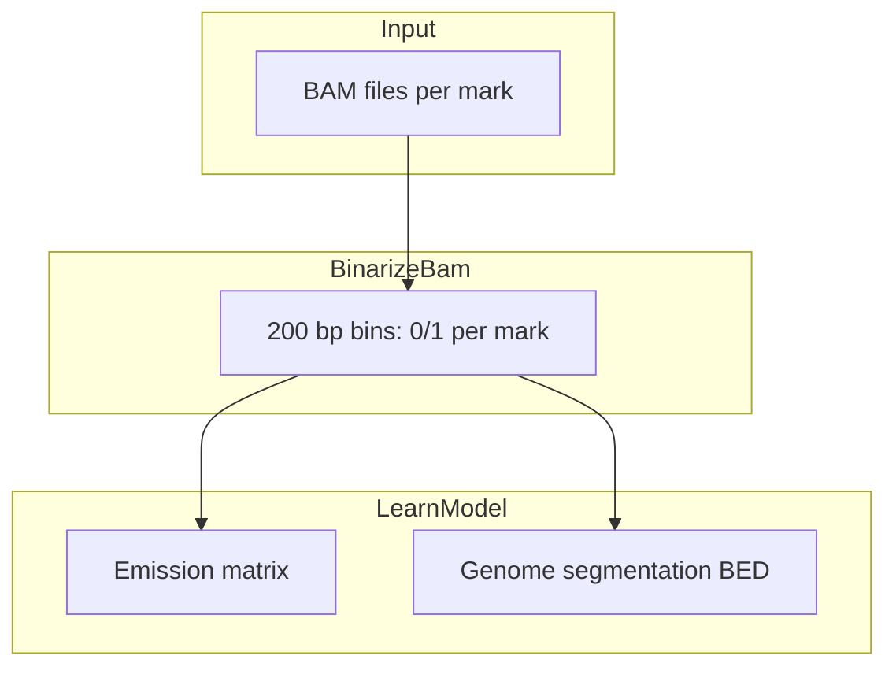

# ChromHMM Tutorial: Annotating the K562 Epigenome

This tutorial is for anyone new to ChromHMM. It walks through **what** the tool does, **why** we chose these histone marks, **how** to run our pipeline on Windows, and **how** to interpret outputs once model training finishes.

**Repository:** `C:\Users\mukun\chromhmm-project`  
**Team project:** [COURSE NAME/NUMBER], UC Irvine (Advisor: Dr. Jing Zhang)

---

## 1. What ChromHMM does

Histone ChIP-seq experiments measure where each modification sits on the genome. With six marks, every 200 bp bin has six binary (or quasi-binary) readouts—too many combinations to label by hand.

ChromHMM:

1. **Binarizes** each mark (signal on/off per bin) from aligned reads (BAM).
2. **Learns** a hidden Markov model: hidden **states** (e.g., enhancer, promoter), **emissions** (probability each mark is on in that state), and **transitions** (how states change along the chromosome).
3. **Segments** the genome: each interval in the output BED file is assigned a state ID.



**Key output files** (after `LearnModel`, under `models/K562_15state/`):

| File | Meaning |
|------|---------|
| `emissions_15.txt` | For each state, P(mark on) — used to name states |
| `*_15_segments.bed` | Genomic intervals + state labels |
| `model_15.txt` | Full HMM parameters |

---

## 2. Why these six histone marks?

Roadmap and ENCODE use a **core set** that separates major chromatin compartments:

- **H3K4me3** — active TSS / promoters  
- **H3K4me1 + H3K27ac** — enhancers (active vs poised)  
- **H3K36me3** — transcription elongation / gene bodies  
- **H3K27me3** — Polycomb repression  
- **H3K9me3** — heterochromatin  
- **Input** — background for peak calling / binarization  

Using the same six marks as reference epigenomes makes our state labels comparable to published 15-state maps.

---

## 3. Running the pipeline

Run scripts **in order** from the repo root in PowerShell:

```powershell
cd C:\Users\mukun\chromhmm-project
```

| Step | Script | What it does |
|------|--------|----------------|
| 1 | `.\scripts\01_setup.ps1` | Folders, download ChromHMM, check Java |
| 2 | `.\scripts\02_binarize.ps1` | `BinarizeBam` → `data/binarized/` |
| 3 | `.\scripts\03_learn_model.ps1` | `LearnModel` → `models/K562_15state/` |
| 4 | `.\scripts\04_overlap_enrichment.ps1` | Overlap vs. genes, exons, etc. |
| 5 | `.\scripts\05_neighborhood_enrichment.ps1` | Enrichment around TSS windows |
| 6 | `python .\scripts\06_interpret_states.py` | Labels + emissions heatmap |

To try a different state count:

```powershell
.\scripts\03_learn_model.ps1 -NumStates 18
.\scripts\04_overlap_enrichment.ps1 -NumStates 18
.\scripts\05_neighborhood_enrichment.ps1 -NumStates 18
```

(Update `NUM_STATES` in `06_interpret_states.py` to match.)

**Before step 2:** place ENCODE BAMs in `data/raw/` as named in `data/raw/cellmarkfiletable.txt`.

---

## 4. Interpreting the emissions heatmap

<!-- TODO: Replace with project-specific figure and narrative after LearnModel completes -->

> **TODO (after model training):** Insert `results/emissions_heatmap_15state.png` here and walk through 2–3 example states from `results/state_annotations.tsv`.

**How to read the heatmap** (once `06_interpret_states.py` has been run):

- **Rows** = chromatin states (1 … 15).  
- **Columns** = histone marks.  
- **Color intensity** = emission probability (0 = mark usually off, 1 = usually on in that state).

**Canonical patterns** (from Roadmap nomenclature):

| Pattern | Suggested label |
|---------|-----------------|
| H3K4me3 high | Active TSS |
| H3K4me3 + H3K27ac | Active Promoter |
| H3K4me1 + H3K27ac high, H3K4me3 low | Active Enhancer |
| H3K4me1 high, H3K27ac low | Poised/Primed Enhancer |
| H3K36me3 high | Transcribed |
| H3K27me3 high | Polycomb Repressed |
| H3K9me3 high | Heterochromatin |
| All marks low | Quiescent |

Automated suggestions are in `results/state_annotations.tsv`; always sanity-check against overlap/neighborhood enrichment HTML in `results/`.

---

## 5. Finding functional regions in the segmentation BED

<!-- TODO: Update SEGMENTS_BED path after LearnModel if filename differs -->

After training, ChromHMM writes a BED file such as:

`models/K562_15state/K562_15state_15_segments.bed`

Columns are typically: `chrom`, `start`, `end`, `state` (exact naming may vary slightly by version).

**Install bedtools** (WSL, conda, or binary) for intersection and filtering.

### List how many bins per state

```bash
cut -f4 models/K562_15state/K562_15state_15_segments.bed | sort | uniq -c | sort -k2n
```

### Find all intervals in state 4 (example — replace `4` with your enhancer state ID)

```bash
awk '$4==4' models/K562_15state/K562_15state_15_segments.bed > results/state4_intervals.bed
```

### Active enhancers near a gene (illustrative)

Suppose state **7** is your **Active Enhancer** label from `state_annotations.tsv`, and you want regions within **50 kb** of the *BCL2* locus (adjust coordinates for hg38):

```bash
# Gene locus (example coordinates — verify in UCSC/Ensembl)
echo -e "chr18\t60750000\t60900000\tBCL2" > results/BCL2_locus.bed

# Enhancer state only
awk '$4==7' models/K562_15state/K562_15state_15_segments.bed > results/active_enhancer_state7.bed

# Intersect with 50 kb window around the gene
bedtools slop -i results/BCL2_locus.bed -g chrom.sizes -b 50000 > results/BCL2_slop50kb.bed
bedtools intersect -a results/active_enhancer_state7.bed -b results/BCL2_slop50kb.bed -u > results/BCL2_near_enhancers.bed
```

You need a `chrom.sizes` file for hg38 (available from UCSC or ChromHMM resources).

### Overlap enhancers with a ChIP peak set

```bash
bedtools intersect -a results/active_enhancer_state7.bed -b your_peaks.bed -wa > results/enhancers_with_peaks.bed
```

---

## 6. Common pitfalls

| Issue | What to do |
|-------|------------|
| **`java` not found** | Install JDK 8+, restart terminal, re-run `01_setup.ps1` |
| **OutOfMemoryError** | Increase heap in scripts (e.g. `-mx8000M`) or close other apps |
| **Chromosome name mismatch** | BAM contigs must match hg38 (`chr1` vs `1`). Use consistent naming; consider `samtools` reheader if needed |
| **BinarizeBam very slow** | Normal for whole-genome BAMs; run overnight |
| **LearnModel even slower** | Often 12–48+ hours depending on CPU/RAM and disk |
| **Empty binarized folder** | Check BAM paths in `cellmarkfiletable.txt` match filenames in `data/raw/` |
| **OverlapEnrichment fails** | Run `03_learn_model.ps1` first; confirm `COORDS/hg38` exists under extracted ChromHMM |

---

## 7. Ideas for further analysis

- **Compare state counts** across `-NumStates` (10 vs 15 vs 25) using emissions and enrichment.  
- **Intersect** segmentations with ENCODE cCREs, GWAS summary-stat loci, or eQTLs.  
- **Merge** consecutive bins of the same state for cleaner regions.  
- **Visualize** a locus in IGV: load BAMs, segmentation BED, and RefSeq genes.  
- **Cross-cell-line** comparison if you add GM12878 or other marks later.

---

## 8. Results checklist (team TODO)

- [ ] LearnModel finished for 15 states  
- [ ] Paste emissions heatmap into this tutorial (Section 4)  
- [ ] Record final state → biology label table  
- [ ] Summarize top overlap enrichments (promoter states at TSS, etc.)  
- [ ] Add one IGV screenshot for the report  

For questions about course deliverables, contact Dr. Jing Zhang ([zhang.jing@uci.edu](mailto:zhang.jing@uci.edu)).
